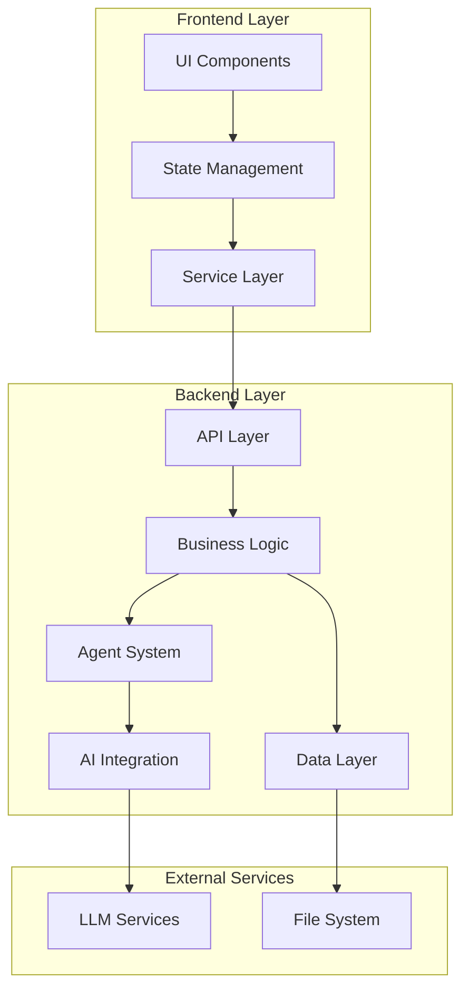
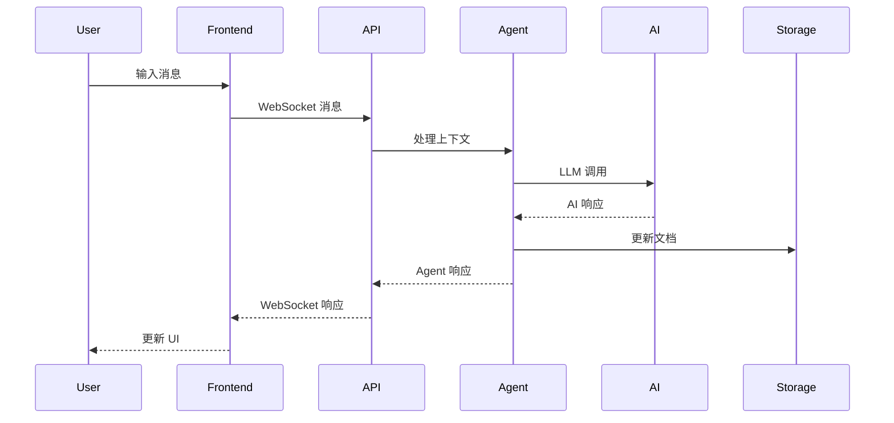
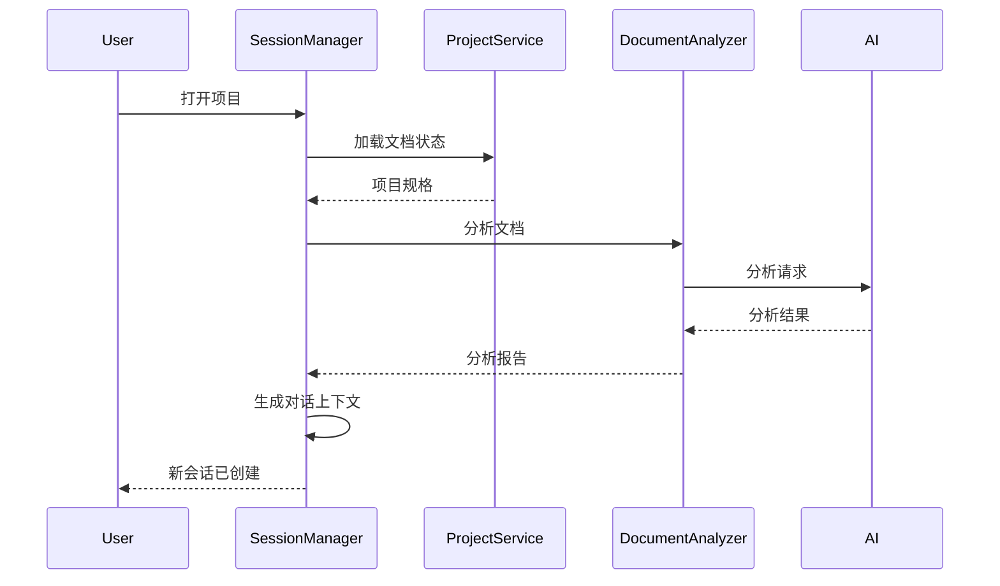

# Clario 技术设计文档

**文档版本**: 1.0.0  
**创建日期**: 2025-08-21  
**维护团队**: Clario 开发团队

## 目录

1. [概述](#1-概述)
2. [系统架构](#2-系统架构)
3. [核心组件设计](#3-核心组件设计)
4. [API 接口规范](#4-api-接口规范)
5. [数据流设计](#5-数据流设计)
6. [开发计划](#6-开发计划)
7. [技术决策记录](#7-技术决策记录)

## 1. 概述

### 1.1 技术目标

基于 clario-spec.md 的业务需求，实现一个**多智能体协作的需求澄清与文档生成平台**，支持：

- 渐进式对话澄清功能
- 多智能体协作系统
- 实时文档预览与同步
- 轻量化需求规格文档生成
- A2 模式的会话管理

### 1.2 非功能性要求

- **可维护性**: 模块化设计，高内聚低耦合
- **可演化性**: 支持 A2→C 会话模式演进
- **可测试性**: TDD 驱动，端到端测试覆盖
- **协作友好**: 任务边界清晰，初级工程师可快速上手

### 1.3 技术约束

- **性能**: MVP 阶段核心交互 ≤5 秒响应时间
- **可靠性**: 本地文件系统的数据可靠性保证
- **兼容性**: 支持 Windows/macOS/Linux 开发环境
- **扩展性**: 预留 SaaS 化的架构扩展能力

---

## 2. 系统架构

### 2.1 整体架构图



### 2.2 技术栈选择

**Frontend Stack:**
- **React 18** + TypeScript: 组件化 UI 开发
- **Vite**: 快速构建工具
- **TanStack Query**: 服务端状态管理
- **Zustand**: 客户端状态管理
- **React Markdown**: 实时文档渲染
- **Socket.IO Client**: 实时通信

**Backend Stack:**
- **FastAPI**: 高性能异步 API 框架
- **Python 3.12** + **uv**: 现代依赖管理
- **Pydantic**: 数据验证和序列化
- **AsyncIO**: 异步编程支持
- **Socket.IO**: 实时通信支持
- **OpenAI/Anthropic SDK**: LLM 集成

**Development Tools:**
- **pytest** + **Vitest** + **Playwright**: 测试工具链
- **Ruff** + **ESLint**: 代码质量
- **MyPy**: 静态类型检查

---

## 3. 核心组件设计

### 3.1 多智能体协作系统

#### 3.1.1 Agent 抽象层设计

```python
# backend/src/app/agents/base.py
from abc import ABC, abstractmethod
from typing import Any, Dict, List
from pydantic import BaseModel

class AgentContext(BaseModel):
    """智能体上下文"""
    project_spec: Dict[str, Any]
    conversation_history: List[Dict[str, Any]]
    current_focus: str  # 当前讨论焦点
    user_input: str
    
class AgentResponse(BaseModel):
    """智能体响应"""
    agent_type: str
    content: str
    suggestions: List[str] = []
    document_updates: Dict[str, Any] = {}
    next_action: str | None = None

class BaseAgent(ABC):
    """智能体基类"""
    
    def __init__(self, llm_client):
        self.llm_client = llm_client
        self.agent_type = self.__class__.__name__
    
    @abstractmethod
    async def process(self, context: AgentContext) -> AgentResponse:
        """处理用户输入并返回响应"""
        pass
    
    @abstractmethod
    def get_system_prompt(self) -> str:
        """获取系统提示词"""
        pass
```

#### 3.1.2 具体 Agent 实现

```python
# backend/src/app/agents/scope_planner.py
class ScopePlannerAgent(BaseAgent):
    """范围规划师 - 负责项目范围定义和边界控制"""
    
    def get_system_prompt(self) -> str:
        return """你是一个专业的项目范围规划师。你的职责是：
        1. 帮助用户明确项目边界，区分范围内外功能
        2. 基于核心价值和目标用户，挑战不合理的范围设定
        3. 提出范围优化建议，确保项目聚焦核心价值
        4. 识别范围蔓延风险，提醒用户控制项目复杂度
        """
    
    async def process(self, context: AgentContext) -> AgentResponse:
        # 分析当前项目范围
        # 调用 LLM 生成范围建议
        # 返回结构化响应
        pass

# backend/src/app/agents/reviewer.py  
class ReviewerAgent(BaseAgent):
    """审查员 - 负责文档质量和一致性检查"""
    
    def get_system_prompt(self) -> str:
        return """你是一个严谨的需求审查员。你的职责是：
        1. 检查需求文档的逻辑一致性
        2. 识别核心理念与具体场景的矛盾
        3. 发现遗漏的验收标准或依赖关系
        4. 提供具体可行的改进建议
        """

# backend/src/app/agents/recorder.py
class RecorderAgent(BaseAgent):
    """记录员 - 负责决策记录和变更追踪"""

# backend/src/app/agents/promoter.py  
class PromoterAgent(BaseAgent):
    """推进者 - 负责识别下一步行动和推动进度"""
```

#### 3.1.3 Agent 协调器

```python
# backend/src/app/agents/orchestrator.py
class AgentOrchestrator:
    """智能体协调器 - 管理多个 Agent 的协作"""
    
    def __init__(self):
        self.agents: Dict[str, BaseAgent] = {}
        self.conversation_state = ConversationState()
    
    async def process_user_input(
        self, 
        user_input: str, 
        project_spec: Dict[str, Any],
        conversation_history: List[Dict[str, Any]]
    ) -> AgentResponse:
        """
        根据上下文选择合适的 Agent 处理用户输入
        """
        # 1. 分析用户意图
        intent = await self._analyze_user_intent(user_input, conversation_history)
        
        # 2. 选择最合适的 Agent
        agent = self._select_agent(intent, project_spec)
        
        # 3. 构建 Agent 上下文
        context = AgentContext(
            project_spec=project_spec,
            conversation_history=conversation_history,
            current_focus=intent.focus_area,
            user_input=user_input
        )
        
        # 4. 调用 Agent 处理
        response = await agent.process(context)
        
        # 5. 更新会话状态
        self._update_conversation_state(response)
        
        return response
    
    def _select_agent(self, intent: UserIntent, project_spec: Dict[str, Any]) -> BaseAgent:
        """根据用户意图选择合适的 Agent"""
        if intent.action_type == "scope_definition":
            return self.agents["scope_planner"]
        elif intent.action_type == "review_request":  
            return self.agents["reviewer"]
        elif intent.action_type == "record_decision":
            return self.agents["recorder"]
        else:
            return self.agents["promoter"]  # 默认推进者
```

### 3.2 实时文档预览系统

#### 3.2.1 Frontend 双栏布局

```typescript
// frontend/src/components/WorkspaceLayout.tsx
interface WorkspaceLayoutProps {
  projectId: string;
}

export const WorkspaceLayout: React.FC<WorkspaceLayoutProps> = ({ projectId }) => {
  return (
    <div className="workspace-layout">
      <div className="conversation-panel">
        <ConversationInterface projectId={projectId} />
      </div>
      <div className="preview-panel">
        <LiveDocumentPreview projectId={projectId} />
      </div>
    </div>
  );
};
```

#### 3.2.2 实时同步管理器

```typescript
// frontend/src/services/RealTimeSyncManager.ts
export class RealTimeSyncManager {
  private socket: Socket;
  private documentState: ProjectSpec;
  private highlightManager: HighlightManager;
  
  constructor(projectId: string) {
    this.socket = io(`ws://localhost:8000/projects/${projectId}`);
    this.setupEventHandlers();
  }
  
  private setupEventHandlers() {
    // 监听文档更新事件
    this.socket.on('document_updated', (updates: DocumentUpdate) => {
      this.applyDocumentUpdates(updates);
    });
    
    // 监听 AI 标注事件
    this.socket.on('ai_annotation', (annotation: AIAnnotation) => {
      this.highlightManager.addHighlight(annotation);
    });
  }
  
  async applyDocumentUpdates(updates: DocumentUpdate) {
    // 应用增量更新到本地文档状态
    // 触发 UI 重新渲染
    // 处理冲突解决
  }
  
  async sendUserInput(input: string): Promise<void> {
    // 发送用户输入到后端
    this.socket.emit('user_input', { 
      content: input, 
      timestamp: new Date().toISOString() 
    });
  }
}
```

#### 3.2.3 文档高亮系统

```typescript
// frontend/src/components/HighlightManager.ts
interface AIAnnotation {
  id: string;
  type: 'conflict' | 'suggestion' | 'question';
  target: DocumentLocation;
  content: string;
  severity: 'high' | 'medium' | 'low';
  actionable: boolean;
}

export class HighlightManager {
  private annotations: Map<string, AIAnnotation> = new Map();
  
  addHighlight(annotation: AIAnnotation) {
    this.annotations.set(annotation.id, annotation);
    this.renderHighlight(annotation);
  }
  
  private renderHighlight(annotation: AIAnnotation) {
    // 在文档预览中渲染高亮标注
    // 支持点击展开详细说明
    // 提供"采纳建议"交互按钮
  }
  
  async acceptSuggestion(annotationId: string): Promise<void> {
    // 采纳 AI 建议，更新文档内容
  }
}
```

### 3.3 会话管理架构（A2 模式）

#### 3.3.1 会话管理器

```python
# backend/src/app/services/session.py
from typing import Dict, Any, Optional
from datetime import datetime

class SessionState(BaseModel):
    """会话状态"""
    session_id: str
    project_id: str
    created_at: datetime
    conversation_history: List[Dict[str, Any]] = []
    current_context: Dict[str, Any] = {}
    ai_analysis: Optional[Dict[str, Any]] = None

class SessionManager:
    """A2 模式会话管理器"""
    
    def __init__(self, project_service: ProjectService, ai_service: AIService):
        self.project_service = project_service
        self.ai_service = ai_service
        self.active_sessions: Dict[str, SessionState] = {}
    
    async def create_new_session(self, project_id: str) -> SessionState:
        """创建新会话（A2 模式核心）"""
        # 1. 加载项目文档状态
        project_spec = await self.project_service.load_project(project_id)
        
        # 2. AI 重新分析文档
        analysis = await self._analyze_document_state(project_spec)
        
        # 3. 生成初始对话上下文
        initial_context = await self._generate_conversation_context(analysis)
        
        # 4. 创建会话状态
        session = SessionState(
            session_id=self._generate_session_id(),
            project_id=project_id,
            created_at=datetime.utcnow(),
            current_context=initial_context,
            ai_analysis=analysis
        )
        
        self.active_sessions[session.session_id] = session
        return session
    
    async def _analyze_document_state(self, project_spec: Dict[str, Any]) -> Dict[str, Any]:
        """AI 分析文档当前状态"""
        analysis_prompt = f"""
        分析以下项目规格文档的当前状态：
        
        {project_spec}
        
        请识别：
        1. 已完成的部分和质量评估
        2. 缺失或不完整的关键信息
        3. 潜在的一致性问题
        4. 建议的下一步行动
        """
        
        analysis = await self.ai_service.analyze(analysis_prompt)
        return {
            "completed_sections": analysis.completed_sections,
            "missing_info": analysis.missing_info,
            "consistency_issues": analysis.consistency_issues,
            "suggested_actions": analysis.suggested_actions
        }
    
    async def _generate_conversation_context(self, analysis: Dict[str, Any]) -> Dict[str, Any]:
        """基于分析结果生成对话上下文"""
        return {
            "current_phase": self._determine_current_phase(analysis),
            "focus_areas": analysis["suggested_actions"][:3],  # 前3个重点
            "questions_to_ask": self._generate_probing_questions(analysis),
            "context_summary": analysis["completed_sections"]
        }
```

#### 3.3.2 文档状态分析器

```python
# backend/src/app/services/document_analyzer.py
class DocumentAnalyzer:
    """文档状态分析器"""
    
    async def analyze_completeness(self, project_spec: Dict[str, Any]) -> CompletenessReport:
        """分析文档完整度"""
        report = CompletenessReport()
        
        # 检查必需字段
        if not project_spec.get("coreIdea"):
            report.add_missing("核心理念未定义")
        
        # 检查场景完整度
        scenarios = project_spec.get("scenarios", [])
        if len(scenarios) == 0:
            report.add_missing("缺少用户场景定义")
        
        # 检查验收标准
        for scenario in scenarios:
            if not scenario.get("acceptanceCriteria"):
                report.add_incomplete(f"场景 {scenario['name']} 缺少验收标准")
        
        return report
    
    async def detect_inconsistencies(self, project_spec: Dict[str, Any]) -> List[Inconsistency]:
        """检测文档内一致性问题"""
        inconsistencies = []
        
        # 检查核心价值与范围一致性
        core_value = project_spec.get("coreIdea", {}).get("coreValue", "")
        scope = project_spec.get("scope", {})
        
        # 使用 AI 检测语义层面的不一致
        consistency_check = await self.ai_service.check_consistency(
            core_value, scope, project_spec.get("scenarios", [])
        )
        
        return consistency_check.inconsistencies
```

---

## 4. API 接口规范

### 4.1 RESTful API 设计

#### 4.1.1 项目管理 API

```python
# 已有的项目管理 API 保持不变
# GET /projects - 获取项目列表
# POST /projects - 创建项目  
# GET /projects/{project_id} - 获取项目详情
# PUT /projects/{project_id} - 更新项目
# DELETE /projects/{project_id} - 删除项目
```

#### 4.1.2 AI 对话 API

```python
# backend/src/app/api/conversation.py
@router.post("/projects/{project_id}/conversation")
async def send_message(
    project_id: str,
    request: ConversationRequest
) -> ConversationResponse:
    """发送用户消息并获取 AI 响应"""
    
@router.get("/projects/{project_id}/conversation/history")
async def get_conversation_history(
    project_id: str,
    session_id: Optional[str] = None
) -> List[ConversationMessage]:
    """获取对话历史"""

@router.post("/projects/{project_id}/sessions")
async def create_session(project_id: str) -> SessionResponse:
    """创建新会话（A2 模式）"""
```

#### 4.1.3 文档分析 API

```python
# backend/src/app/api/analysis.py
@router.post("/projects/{project_id}/analyze")
async def analyze_document(project_id: str) -> AnalysisResponse:
    """分析文档状态并生成建议"""

@router.get("/projects/{project_id}/consistency-check")
async def check_consistency(project_id: str) -> ConsistencyReport:
    """检查文档一致性"""
```

### 4.2 WebSocket 实时通信

```python
# backend/src/app/websocket/conversation.py
@app.websocket("/ws/projects/{project_id}")
async def websocket_conversation(websocket: WebSocket, project_id: str):
    """项目对话的 WebSocket 连接"""
    await websocket.accept()
    
    try:
        while True:
            # 接收用户消息
            data = await websocket.receive_json()
            
            # 处理消息
            response = await process_user_message(project_id, data)
            
            # 发送 AI 响应
            await websocket.send_json(response)
            
            # 发送文档更新（如有）
            if response.document_updates:
                await websocket.send_json({
                    "type": "document_update",
                    "updates": response.document_updates
                })
                
    except WebSocketDisconnect:
        # 清理连接
        pass
```

---

## 5. 数据流设计

### 5.1 核心数据流



### 5.2 会话恢复流程（A2 模式）



---

## 6. 开发计划

### 6.1 开发里程碑

#### Phase 0: 基础设施搭建 (1-2 周)
**目标**: 建立核心技术基础设施

**Backend 任务**:
- [ ] 实现 BaseAgent 抽象层
- [ ] 集成 OpenAI/Anthropic LLM 服务
- [ ] 实现 SessionManager 基础框架
- [ ] 搭建 WebSocket 基础架构
- [ ] 扩展现有 API 支持对话功能

**Frontend 任务**:
- [ ] 搭建双栏布局组件
- [ ] 实现 Zustand 状态管理
- [ ] 集成 Socket.IO 客户端
- [ ] 建立 RealTimeSyncManager
- [ ] 实现基础的 Markdown 预览

**验收标准**:
- [ ] 前后端可以通过 WebSocket 通信
- [ ] AI 服务集成可用，能调用 LLM
- [ ] 双栏布局可以实时同步简单的文档更新
- [ ] 单元测试覆盖率 ≥80%

#### Phase 1: MVP 核心场景 (4-6 周)

**Sprint 1 - 项目管理基础 (1 周)**
- [ ] `scn-project-dashboard`: 项目仪表盘 UI
- [ ] `scn-create-project`: 项目创建流程

**Sprint 2 - AI 引导探索 (1.5 周)**
- [ ] `scn-guided-ideation`: 实现引导式想法探索
- [ ] 实现 PromoterAgent 和引导提问逻辑
- [ ] 核心理念表单和实时预览

**Sprint 3 - 范围协作定义 (1.5 周)** 
- [ ] `scn-collaborative-scoping`: 范围定义界面
- [ ] 实现 ScopePlannerAgent 和范围挑战逻辑
- [ ] 范围列表的实时更新

**Sprint 4 - 实时预览系统 (2 周)**
- [ ] `scn-live-preview`: 完整的实时文档预览
- [ ] 文档高亮和标注系统
- [ ] AI 建议的可视化展示

**验收标准**:
- [ ] 用户可以创建项目并完成核心理念定义
- [ ] AI 可以引导用户完成范围定义
- [ ] 实时预览可以同步显示文档变化
- [ ] E2E 测试覆盖核心用户旅程

#### Phase 2: 高级功能 (3-4 周)

**Sprint 5 - 会话管理和恢复 (1.5 周)**
- [ ] `scn-resume-work`: A2 模式的会话恢复
- [ ] 文档状态分析和上下文重建
- [ ] 会话历史管理

**Sprint 6 - 文档导出和质量检查 (1.5 周)**
- [ ] `scn-export-document`: 文档导出功能
- [ ] 实现 ReviewerAgent 和一致性检查
- [ ] 文档质量报告

**验收标准**:
- [ ] 用户重新打开项目时可以无缝恢复工作
- [ ] 可以导出格式规范的 Markdown 和 JSON 文档
- [ ] AI 可以检测并提示文档一致性问题

### 6.2 团队分工建议

**后端开发工程师**:
- Agent 系统实现
- AI 服务集成
- WebSocket 实时通信
- 会话管理逻辑

**前端开发工程师**:
- React 组件开发
- 状态管理和数据流
- 实时预览和同步
- 用户交互体验

**全栈工程师**:
- API 接口开发
- 端到端功能集成
- 测试工具链维护
- DevOps 和部署

### 6.3 质量保障策略

**TDD 实践**:
1. 每个新功能从 E2E 测试开始
2. API 开发先写 OpenAPI 规范
3. 前端组件先写 Storybook
4. 关键业务逻辑 100% 单元测试覆盖

**代码质量**:
- 每个 PR 必须通过 lint + 类型检查 + 测试
- 关键模块需要 Code Review
- 定期进行技术债务清理

**性能监控**:
- LLM 调用时间监控
- WebSocket 连接质量监控
- 前端渲染性能监控

---

## 7. 技术决策记录

### 决策 1: 选择 Zustand 而非 Redux 进行状态管理

**日期**: 2025-08-21  
**决策者**: 架构团队

**背景**: 需要选择前端状态管理解决方案

**决策**: 采用 Zustand

**理由**:
- 更简单的 API，减少样板代码
- TypeScript 支持更好
- 包体积小，性能更好
- 适合项目规模，避免过度工程化

**被拒绝的选项**:
- Redux Toolkit: API 复杂，对初级开发者不友好
- Context API: 性能问题，不适合频繁更新的实时场景

### 决策 2: 采用 WebSocket 而非 Server-Sent Events

**日期**: 2025-08-21  
**决策者**: 架构团队  

**背景**: 需要实现前后端实时通信

**决策**: 采用 WebSocket (Socket.IO)

**理由**:
- 双向通信支持，用户输入和文档更新都需要实时传输
- Socket.IO 提供断线重连、房间管理等高级功能
- 更好的浏览器兼容性

**被拒绝的选项**:
- Server-Sent Events: 仅支持单向通信
- 轮询: 性能差，实时性不够

### 决策 3: 多 Agent 系统采用协调器模式

**日期**: 2025-08-21
**决策者**: 架构团队

**背景**: 需要设计多个 AI Agent 的协作模式

**决策**: 采用 AgentOrchestrator 协调器模式

**理由**:
- 单一入口，便于意图识别和 Agent 选择
- 可以统一管理对话状态
- 便于后期增加 Agent 间协作逻辑
- 降低 Agent 间耦合

**被拒绝的选项**:
- 链式调用: Agent 间耦合度高
- 事件总线: 复杂度过高，MVP 阶段不必要

---

## 总结

本技术设计文档基于 clario-spec.md 的业务需求，提供了完整的技术实现方案。核心特点：

1. **模块化架构**: 清晰的分层和组件边界
2. **Agent 协作**: 基于协调器的多智能体系统  
3. **实时同步**: WebSocket 支持的文档预览
4. **A2 会话模式**: 支持会话重启的状态管理
5. **TDD 驱动**: 完整的测试策略和质量保障

该设计确保系统的可维护性、可演化性和协作友好性，为团队提供清晰的开发指导。